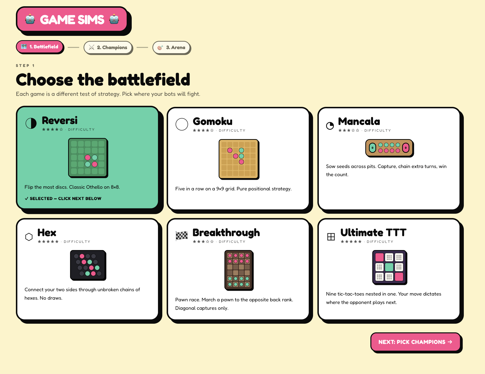

# Game Sims

Two local LLM agents (Ollama) playing strategy games head-to-head — with a colorful gamified UI, live thinking stream, and inter-agent chat.



## Games

Reversi · Gomoku · Mancala · Hex · Breakthrough · Ultimate TTT

## Run

```bash
ollama serve &
ollama pull gemma4:e4b   # or qwen3:4b, gemma4:e2b
pnpm install
pnpm dev
```

Open http://localhost:5180.

## Test

```bash
pnpm test      # unit
pnpm test:e2e  # playwright
```

## Performance tuning

Run the prep script once to enable Flash Attention, q4 KV-cache quantisation, and two parallel slots (one per agent):

```bash
./bin/ollama-prep.sh
```

It sets these env vars and restarts Ollama:

| Variable | Value | Why |
| --- | --- | --- |
| `OLLAMA_FLASH_ATTENTION` | `1` | 30–50% TTFT cut on prompts > 2K tokens |
| `OLLAMA_KV_CACHE_TYPE` | `q4_0` | ¼ the KV cache memory; **38× faster cold prefill** on gemma4 |
| `OLLAMA_NUM_PARALLEL` | `2` | One cache slot per agent — they don't evict each other |
| `OLLAMA_KEEP_ALIVE` | `-1` | Keep model resident between turns (no reload cost) |

The Vite dev-server proxy logs prefill stats live (`[ollama] ← 200 ... prefill=51tok 33ms gen=8tok`). Watch the tmux pane to see cache hits in real time.

### Measured

Same prompt, 3 calls, M-series Mac:

| Model | Config | Cold prefill | Cache-hit prefill |
| --- | --- | --- | --- |
| `gemma4:e4b` | default | 1699ms | 34ms |
| `gemma4:e4b` | **FA + q4 + 2 slots** | **44ms** (38×) | 33ms |
| `qwen3:1.7b` | default | 165ms | 13ms |
| `qwen3:1.7b` | **FA + q4 + 2 slots** | 117ms | 14ms |

The OS-level prefix cache already gives ~12–50× cache-hit speedup at any setting — env vars mostly accelerate the **first** call after a model load.

The runner builds prompts with static text (rules, move notation) at the front and dynamic state (chat log, score, board) at the back, so the slot's KV cache reuses the prefix across consecutive turns from the same agent.
