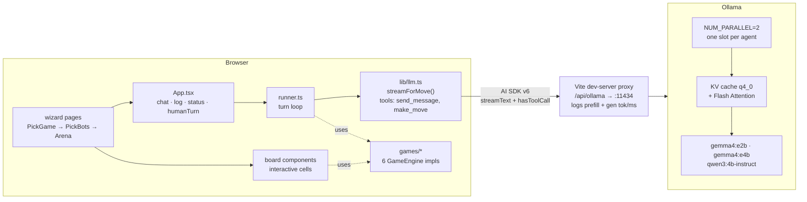
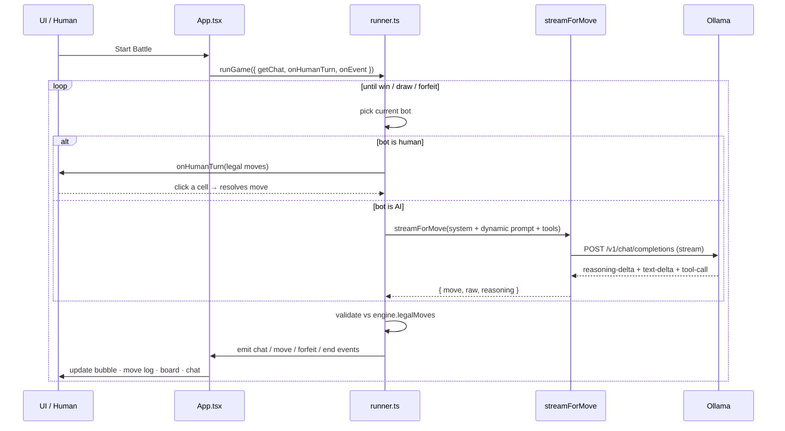

# Architecture & Learnings

A working journal for Game Sims — what's in the box, how it fits together,
and the load-bearing things I'd want to remember next time.

## Stack

- **Vercel AI SDK v6** drives the agent loop (`streamText` + `tool()` + `hasToolCall`).
- **`@ai-sdk/openai-compatible`** talks to Ollama's OpenAI-compatible endpoint.
- **No backend** — the SPA hits Ollama directly through the Vite dev-server proxy.

### Component diagram



### A turn, end-to-end



## Layout

```
src/
  games/       one GameEngine<State, Move> per game
               (reversi, gomoku, mancala, hex, breakthrough, utttt)
  lib/
    llm.ts     streamForMove() — tool definitions + stream parsing
    runner.ts  runGame() — turn loop, threads score/history/chat into prompts
    bots.ts    agent personas
  components/  BotCard, ChatPanel, SidePanel, ThinkingBubble, board renderers
  pages/       PickGamePage → PickBotsPage → ArenaPage (3-step wizard)
  App.tsx     owns chat state, humanTurn promise, status, log
bin/ollama-prep.sh  one-shot Ollama env setup
scripts/      analyze-thinking.ts, verify-legal.ts (offline tools)
e2e/          Playwright wizard tests
```

## The runner loop

```
For each turn:
  status = engine.status(state)
  player = status.turn         (A or B)
  bot    = botA or botB

  if isHuman(bot):
    await UI's onHumanTurn(ctx) → resolves when user clicks a cell
  else:
    streamForMove(client, {bot, opponent, chatHistory, …})
      → streamText with two tools (send_message, make_move)
      → emit reasoning-delta and text-delta to the UI bubble
      → stopWhen: hasToolCall('make_move')

  parseMove → validate against engine.legalMoves
  if invalid 5×: forfeit (NOT a forced fallback move)
  apply, emit outcome + scoreAfter, history.push, loop
```

Chat lives in App.tsx (not the runner). The runner reads via `getChat()` each
turn and emits `chat` events the App folds into state. This lets the human
chat at any time, not only on their turn.

## Key choices that shaped the code

| Choice | Why |
| --- | --- |
| **Real tool calls, not JSON in text** | Gemma 4 is tool-tuned; produces reliable `make_move` calls. AI SDK handles the loop. |
| **Two tools (`make_move` required, `send_message` optional)** | Agents *choose* whether to chat. Emergent personalities. |
| **No `read_chat` tool** | The full log is in the prompt — saves a tool roundtrip. |
| **Forfeit on parse failure** | Surfaces real model failures instead of masking them with a fallback move. Cleaner evaluation signal. |
| **Per-engine `score` and `describeOutcome`** | The runner can thread "*+3 flipped, +extra turn*" feedback into the next prompt without engine-specific code. |
| **State sync via `session.engineId !== engineId` check during render** | Without it, React would pass a ReversiState into the MancalaBoard between renders → crash. |

## Prompt engineering that matters

1. **System prompt = static; user prompt = dynamic.** Lets Ollama's KV cache
   reuse the system prefix across consecutive turns from the same agent.
2. **Static text *first* in the user prompt, dynamic state *last*.** Same
   reason. Also puts the freshest info closest to "your move" decision.
3. **"(NEW) since your last move" tag on opponent's recent chat.** Small models
   skim past chat history without this; the explicit recency marker
   dramatically increases conversational responsiveness.
4. **Last 5 chat messages, not 10.** Less noise, more focus.
5. **Move notation as a hard "you MUST pick from these" framing.** Reduces
   illegal-move attempts.

## Ollama perf tuning

Set via `bin/ollama-prep.sh` (launchctl env + restart):

| Env var | Value | What it does |
| --- | --- | --- |
| `OLLAMA_FLASH_ATTENTION` | `1` | 30–50% prefill speedup on long prompts |
| `OLLAMA_KV_CACHE_TYPE` | `q4_0` | ¼ the KV cache memory; **38× cold prefill speedup on gemma4** |
| `OLLAMA_NUM_PARALLEL` | `2` | One cache slot per agent — they don't evict each other |
| `OLLAMA_KEEP_ALIVE` | `-1` | Model stays in VRAM between turns |

Measured (M-series Mac, same prompt 3×):

| Model | Cold prefill | Cache-hit prefill |
| --- | --- | --- |
| `gemma4:e4b` (default) | 1699 ms | 34 ms |
| `gemma4:e4b` (FA + q4 + 2 slots) | **44 ms** | 33 ms |
| `qwen3:1.7b` | 165 ms → 117 ms | 13 ms |

The OS-level prefix cache (always on) already buys 12–50× cache-hit speedup.
The env vars accelerate the *first* call after a model load.

## Debugging & analysis loop

How I actually iterated on the agents — the process, not just the result.

### 1. Vite proxy logs every Ollama call

The dev-server proxy at `/api/ollama/v1` intercepts traffic and prints a
one-line summary per call to stdout. With the dev server running inside
`tmux attach -t llm-arena`, you watch the conversation live:

```
[ollama] → POST /v1/chat/completions
[ollama]   model=gemma4:e4b temp=0.7 last-msg: For the make_move tool…
[ollama] ← 200 POST /v1/chat/completions (1244ms) prefill=312tok 47ms gen=58tok
```

The crucial number is `prefill=Ntok Nms`. Ollama's response carries
`prompt_eval_count` and `prompt_eval_duration`; the proxy regex-extracts them.
When the next turn's prefill ms drops sharply, prefix caching just hit.
Whole flow lives in `vite.config.ts`'s proxy `configure` block.

### 2. `scripts/analyze-thinking.ts` — capture full reasoning

When the in-app bubble is too small to spot behavioural problems, run a
controlled turn against each model and dump the entire stream:

```bash
pnpm dlx tsx scripts/analyze-thinking.ts
```

Outputs per model: total ms, reasoning chars, free-text chars, the chat
message (if any), the move picked, and whether it was legal. Wrote it as a
one-off, kept it because it answered "why are the agents acting weird"
several times — first run revealed:

- gemma4 emits reasoning as `reasoning-delta` parts (not `text-delta`) →
  the bubble was silent for 20s
- qwen3:4b monologued for 360s
- qwen3:1.7b never invoked `make_move`

Without capturing the raw stream I'd have kept blaming the prompt.

### 3. `scripts/verify-legal.ts` — engine sanity check

When a model picks a move I think is illegal but the engine accepts it (or
vice versa), I don't argue with the engine — I print its state:

```bash
pnpm dlx tsx scripts/verify-legal.ts
```

Reads each engine's `initial()` and `legalMoves()`, compares against
textbook openings (Reversi opens with C4/D3/E6/F5; post-D3 reply set is
C3/C5/E3; etc.). When this prints `Match: ✓` for every game I stop
suspecting the engine and look elsewhere.

### 4. The loop in practice

```
  observe in tmux logs / chat bubble → suspect something
       ↓
  run scripts/analyze-thinking.ts on the suspect setup
       ↓
  read full raw stream → identify the actual cause
  (parts type wrong? prompt section ignored? model
   tool-call-incapable? reasoning runaway?)
       ↓
  smallest fix that addresses the cause
       ↓
  rerun the script → compare numbers
       ↓
  commit only if numbers actually improved
```

This loop caught the four biggest bugs in roughly an hour. Cheaper than
guessing.

## Learnings (the stuff I'd forget without writing down)

1. **Reasoning models stream as `reasoning-delta`, not `text-delta`.** Gemma 4
   emits its `<think>` block as `reasoning-delta` parts in AI SDK v6. If you
   only listen for `text-delta`, the bubble looks frozen for 20s.

2. **`qwen3:4b` (bare tag) is thinking-by-default and the `/no_think`
   directive only partially works through Ollama.** Use `qwen3:4b-instruct`
   instead — same weights, thinking disabled at the chat-template level.
   Drops a turn from 290s to ~3.5s.

3. **`qwen3:1.7b` doesn't reliably emit tool calls** through Ollama's
   OpenAI-compat endpoint. It describes the call in prose but never invokes.
   Dropped from defaults.

4. **`maxOutputTokens` in AI SDK doesn't reliably propagate to Ollama
   `num_predict`**, at least for reasoning models. Saw 21k chars of reasoning
   output despite a 1800 token cap. The chat-template-level fix (`-instruct`
   variants, `/no_think`) is more reliable.

5. **`q4_0` KV cache beat `q8_0`** on gemma4 in my workload. The smaller
   footprint kept hot pages in faster memory tiers; q8 had a bizarre
   gen-rate slowdown (0.86 tok/s vs 20 tok/s for q4) on first call.

6. **Stream "reasoning + text" both into the thinking bubble.** Most of the
   visible value of "live thinking" comes from reasoning-delta.

7. **Prefix cache reuse needs the slot to belong to one agent.** With
   `OLLAMA_NUM_PARALLEL=1`, agent A's turn evicts agent B's KV cache and
   vice versa. With 2, each agent has their own warm slot.

8. **React state-sync bug when switching engines mid-render.** Old
   ReversiState reached MancalaBoard for one render before the effect
   reinitialised state, crashed on `state.pits`. Fix: derive `state` inline
   from `engineId` so the rendered state always matches the rendered engine.

9. **`OLLAMA_KEEP_ALIVE=-1` matters for stage demos.** Default 5-minute
   unload window. Easy to exceed during slide-explaining lulls; reload cost
   is ~1.5s, which ruins demo cadence.

10. **Test prompts must be internally consistent.** My first
    `analyze-thinking` script gave models a fabricated Reversi position
    with hand-typed legal moves that didn't match what the engine would
    compute. Models got confused; I blamed the engine. Lesson: always
    derive test states from `engine.apply(state, move)`, never fabricate.

11. **Forfeiting is better than forcing.** When a model can't return a
    legal move after retries, declaring the opponent the winner produces
    cleaner evaluation signal than picking a random fallback move (which
    just masks the failure).

## Demo cadence

- **Pre-warm** all models before going on stage (first call is always slow).
- **`qwen3:4b-instruct` vs `gemma4:e2b`** is the "fast challenger vs visible
  thinker" matchup — fast turns + streaming reasoning, both on stage.
- Open the **Chat tab early** — when bots first taunt each other live, the
  audience reacts. That's the demo's anchor moment.
- Vite proxy logs prefill stats to the dev-server tmux pane so you can show
  "look, prefill dropped from 380 to 24 tokens after the first turn."

## Things I'd build next

- **Tournament harness** — round-robin over (model × game), ELO per model.
- **Vision input** — board screenshots to multimodal Gemma. Compare text vs
  image grounding.
- **More games requiring real dialogue** — Hanabi, Codenames, mini-Diplomacy.
  The chat tool is the underused half of the architecture.
- **Reasoning-model variants on the same model card** — show qwen3:4b-instruct
  side-by-side with qwen3:4b-thinking-2507 so you can A/B "thinking vs not".
